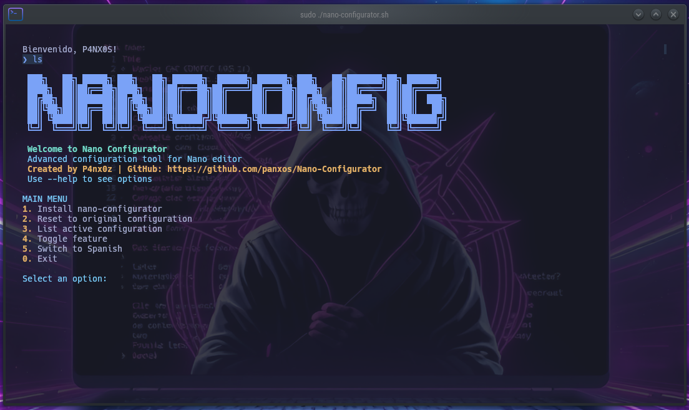
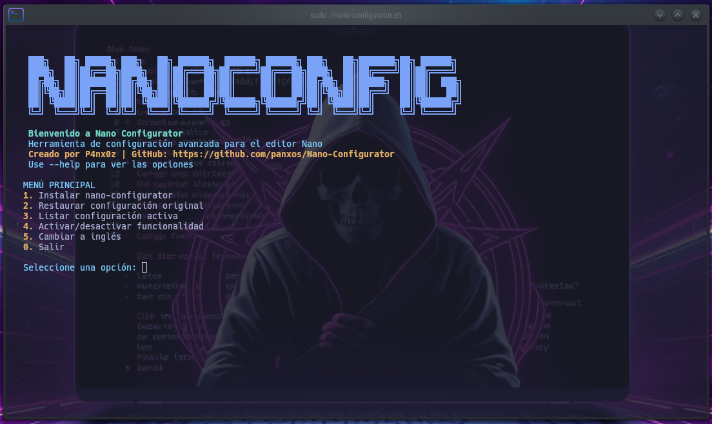

# Nano Configurator 🖥️

🇪🇸 [Español](#español) | 🇬🇧 [English](#english)

## Español

### Descripción

Nano Configurator es una herramienta avanzada de configuración para el editor de texto Nano, diseñada para mejorar y personalizar tu experiencia de edición con facilidad. Este script bash proporciona un conjunto completo de características para modificar la configuración global de Nano.

### Características

- 🌈 Soporte multilenguaje (Inglés y Español)
- 📝 Gestión avanzada de configuración de Nano
- 🔧 Activación/desactivación de diferentes características de edición
- 🛡️ Respaldo de configuración original
- 🚀 Opciones fáciles de instalación y reinicio

### Instalación

1. Clonar el repositorio:
```bash
git clone https://github.com/panxos/Nano-Configurator.git
cd Nano-Configurator
```

2. Hacer el script ejecutable:
```bash
sudo chmod +x nano-configurator.sh
```

### Uso

#### Opciones de Línea de Comandos

- `-h, --help`: Mostrar información de ayuda
- `-i, --install`: Instalar configuración para todos los usuarios
- `-r, --reset`: Restaurar configuración original
- `-l, --list`: Listar configuración activa
- `-t, --toggle ID`: Activar/desactivar características específicas
- `-e, --english`: Establecer idioma a inglés
- `-s, --spanish`: Establecer idioma a español

#### Menú Interactivo

Ejecuta el script sin argumentos para acceder al menú interactivo:
```bash
sudo ./nano-configurator.sh
```

#### Activación de Características

IDs de características disponibles:
- `1` o `line`: Números de línea
- `2` o `syntax`: Resaltado de sintaxis
- `3` o `programming`: Características de programación
- `4` o `behavior`: Comportamiento mejorado del editor
- `5` o `advanced`: Características avanzadas
- `all`: Activar todas las características
- `none`: Desactivar todo excepto resaltado de sintaxis

Ejemplo:
```bash
sudo ./nano-configurator.sh --toggle 1  # Activar/desactivar números de línea
```

### Capturas de Pantalla

| Interfaz en Inglés | Interfaz en Español |
|:------------------:|:-------------------:|
|  |  |

### Requisitos

- Bash
- Nano (versión 2.7.0+)
- Acceso Root/Sudo

### Licencia

Licencia MIT

### Autor

- **Francisco Aravena** (P4nx0z)
- GitHub: https://github.com/panxos

---

## English

### Description

Nano Configurator is an advanced configuration tool for the Nano text editor, designed to enhance and customize your editing experience with ease. This bash script provides a comprehensive set of features to modify Nano's global configuration.

### Features

- 🌈 Multilingual support (English and Spanish)
- 📝 Advanced Nano configuration management
- 🔧 Toggle different editing features
- 🛡️ Backup of original configuration
- 🚀 Easy installation and reset options

### Installation

1. Clone the repository:
```bash
git clone https://github.com/panxos/Nano-Configurator.git
cd Nano-Configurator
```

2. Make the script executable:
```bash
sudo chmod +x nano-configurator.sh
```

### Usage

#### Command Line Options

- `-h, --help`: Display help information
- `-i, --install`: Install configuration for all users
- `-r, --reset`: Restore original configuration
- `-l, --list`: List active configuration
- `-t, --toggle ID`: Toggle specific features
- `-e, --english`: Set language to English
- `-s, --spanish`: Set language to Spanish

#### Interactive Menu

Run the script without arguments to access the interactive menu:
```bash
sudo ./nano-configurator.sh
```

#### Toggling Features

Available feature IDs:
- `1` or `line`: Line numbers
- `2` or `syntax`: Syntax highlighting
- `3` or `programming`: Programming features
- `4` or `behavior`: Improved editor behavior
- `5` or `advanced`: Advanced features
- `all`: Enable all features
- `none`: Disable all except syntax highlighting

Example:
```bash
sudo ./nano-configurator.sh --toggle 1  # Toggle line numbers
```

### Screenshots

| English Interface | Spanish Interface |
|:------------------:|:-------------------:|
|  |  |

### Requirements

- Bash
- Nano (version 2.7.0+)
- Root/Sudo access

### License

MIT License

### Author

- **Francisco Aravena** (P4nx0z)
- GitHub: https://github.com/panxos
